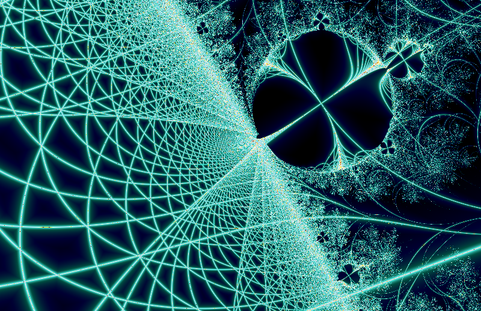
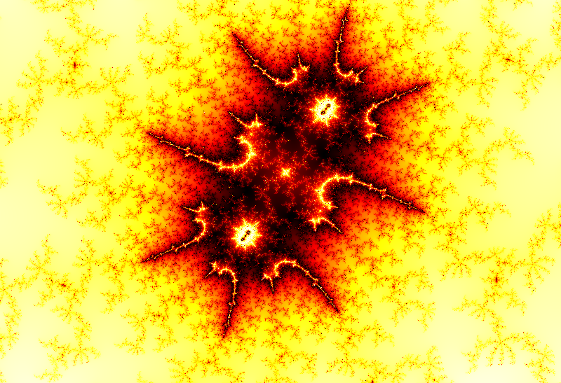

# Fractall

**Explore the infinite beauty of fractals with unlimited zoom depth for the Mandelbrot.**

Fractall is a high-performance fractal explorer written in Rust, featuring real-time GPU rendering, arbitrary-precision arithmetic for deep zooms beyond 10^300, and a modern interactive GUI.


<p align="center">
  
  
</p>
<p align="center">
  <em>Mandelbrot set revealing infinite complexity</em>
</p>

## Features

### Unlimited Zoom Depth
- **Standard precision (f64)**: Instant rendering up to 10^16 zoom
- **Arbitrary precision (GMP)**: Explore beyond 10^300 with automatic precision scaling
- **Perturbation theory**: Optimized deep zoom calculations with BLA (Bilinear Approximation)

### GPU-Accelerated Rendering
- Real-time exploration powered by **wgpu** (Vulkan, Metal, DX12)
- Automatic CPU fallback when GPU isn't available
- Progressive rendering: see previews instantly, full quality follows

### 31 Fractal Types
| Mandelbrot-like | Julia variants | Special |
|-----------------|----------------|---------|
| Mandelbrot, Barnsley, Magnet | Julia, Barnsley Julia, Magnet Julia | Buddhabrot, Nebulabrot |
| Burning Ship, Perp. Burning Ship | Burning Ship Julia, Perp. Burning Ship Julia | Lyapunov |
| Tricorn, Celtic, Buffalo, Multibrot, Alpha Mandelbrot | Tricorn Julia, Celtic Julia, Buffalo Julia, Multibrot Julia, Alpha Mandelbrot Julia | Von Koch, Dragon |
| Mandelbulb | — | Julia Sin, Newton, Phoenix, Nova, Pickover Stalks |

### Rich Coloring Options
- **13 beautiful palettes** with smooth gradients
- **3 color spaces**: RGB, HSB, LCH (perceptually uniform)
- **15 coloring modes**: Smooth, Distance, Orbit Traps, Binary Decomposition, Biomorphs, and more
- **7 plane transformations**: Explore alternative views of familiar fractals

### Smart Session Management
- **Drag & drop** any saved PNG to instantly restore your exact view
- All parameters embedded in PNG metadata (coordinates, zoom, colors, fractal type)
- Share your discoveries - recipients can continue exploring from where you left off!

## Quick Start

### Prerequisites

```bash
# Ubuntu/Debian
sudo apt install libgmp-dev libmpfr-dev libmpc-dev

# macOS
brew install gmp mpfr libmpc

# Arch Linux
sudo pacman -S gmp mpfr libmpc
```

### Build & Run

```bash
# Clone the repository
git clone https://github.com/habib256/fractall-rust.git
cd fractall-rust

# Build in release mode (important for performance!)
cargo build --release

# Launch the interactive GUI
cargo run --release --bin fractall-gui

# Or generate images from command line
cargo run --release --bin fractall-cli -- \
    --type 3 \
    --width 3840 --height 2160 \
    --iterations 1000 \
    --output mandelbrot_4k.png
```

## GUI Controls

| Action | Control |
|--------|---------|
| **Zoom in** | Click / Drag rectangle / Mouse wheel / `+` |
| **Zoom out** | Right-click / `-` |
| **Pan** | Middle-click drag |
| **Reset view** | `0` |
| **Change fractal** | Type menu: Mandelbrots at root, **Julia all** folder for all Julia sets |
| **Julia preview** | Hover over Mandelbrot-like types; **J** to switch to full Julia view |
| **Cycle palette** | `C` |
| **Cycle color repeat** | `R` |
| **Save screenshot** | `S` |
| **Load state** | Drag & drop PNG onto window |

## CLI Reference

```bash
fractall-cli [OPTIONS] --type <N> --output <FILE>

OPTIONS:
    --type <N>              Fractal type (1-24 standard, 25-31 Julia variants)
    --width <W>             Image width [default: 1920]
    --height <H>            Image height [default: 1080]
    --center-x <X>          Center X coordinate
    --center-y <Y>          Center Y coordinate
    --iterations <N>        Maximum iterations
    --palette <0-12>        Color palette [default: 6]
    --color_repeat <N>      Gradient repetitions [default: 40]
    --algorithm <MODE>      auto|f64|perturbation|gmp
    --outcoloring <MODE>    smooth|iter|distance|binary|biomorphs|...
    --plane <N>             Plane transformation (0-6)
    --output <FILE>         Output PNG file
```

### Examples

```bash
# Classic Mandelbrot in 4K
fractall-cli --type 3 -w 3840 -h 2160 -o mandelbrot.png

# Deep zoom into a spiral
fractall-cli --type 3 \
    --center-x=-0.7435669 --center-y=0.1314023 \
    --iterations 5000 \
    --algorithm gmp \
    -o spiral.png

# Burning Ship fractal
fractall-cli --type 13 --palette 2 -o burning_ship.png

# Julia set with custom seed
fractall-cli --type 4 --center-x=-0.8 --center-y=0.156 -o julia.png

# Lyapunov fractal (Zircon City preset)
fractall-cli --type 17 --lyapunov_preset zircon-city -o lyapunov.png
```

## Technical Highlights

- **Perturbation Theory**: Compute deep zooms efficiently by calculating deltas from a high-precision reference orbit
- **BLA Tables**: Skip iterations using bilinear approximation when pixel deltas are small
- **Glitch Detection**: Automatically detect and correct rendering artifacts at extreme zoom levels
- **Reference Orbit Caching**: Reuse expensive GMP calculations when panning at the same zoom level
- **Progressive Rendering**: Multi-pass rendering shows quick previews before full quality

## Contributing

Contributions are welcome! Whether it's:
- New fractal types
- Performance optimizations
- Additional color palettes
- Bug fixes
- Documentation improvements

Please open an issue first to discuss major changes.

## License

This project is licensed under the MIT License - see the [LICENSE](LICENSE) file for details.

## Acknowledgments

- Inspired by [XaoS](https://xaos-project.github.io/), [Kalles Fraktaler](https://mathr.co.uk/kf/kf.html), and [Fraktaler-3](https://mathr.co.uk/web/fraktaler-3.html)
- Perturbation algorithms based on research by K.I. Martin and Claude Heiland-Allen
- Built with [egui](https://github.com/emilk/egui), [wgpu](https://wgpu.rs/), and [rug](https://docs.rs/rug/)

---

<p align="center">
  <i>Fall into the fractal rabbit hole...</i>
</p>
