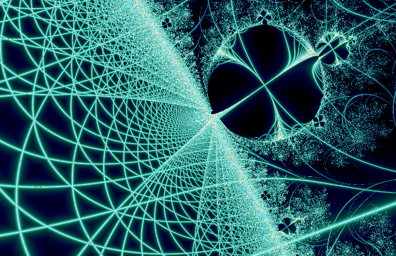
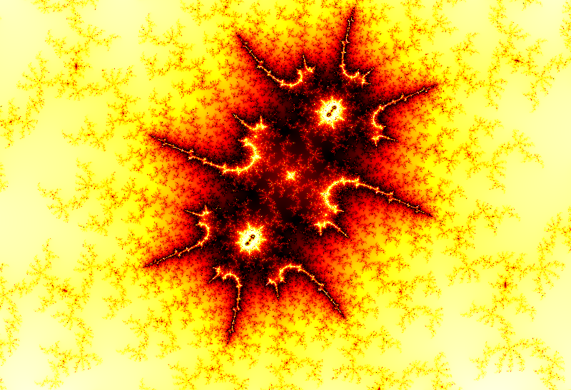

# Fractall

**Explore the infinite beauty of fractals with unlimited zoom depth.**

Fractall is a high-performance fractal explorer written in Rust, featuring GPU rendering, arbitrary-precision arithmetic for deep zooms beyond 10^300, and a modern interactive GUI.


<p align="center">
  
  
</p>
<p align="center">
  <em>Mandelbrot set revealing infinite complexity</em>
</p>

## Features

### Unlimited Zoom Depth
- **Standard precision (f64)**: Instant rendering up to ~10^13 zoom
- **Perturbation + FloatExp + unified bytecode engine**: Deep zoom computed via a Fraktaler-3 style hybrid (BLA `mat2`, delta-form interpreter, proactive F3 rebasing). FloatExp (mantissa + i32 exponent) keeps the per-pixel delta accurate well past 10^1000.
- **Arbitrary precision (GMP)**: Reference orbit and Newton refinement run in MPFR/MPC with precision auto-scaled to zoom — corpus covers up to 10^8000.
- **Atom-domain nucleus finder** (opt-in `--find-nucleus` for Mandelbrot): port of Fraktaler-3.1's `hybrid_period` / `hybrid_center`. Snaps the reference center to the exact minibrot nucleus so the reference orbit stays bounded at deep zoom.

### GPU-Accelerated Rendering
- Powered by **wgpu** (Vulkan, Metal, DX12)
- f32 shaders on GPU — automatic CPU fallback past ~10⁷ zoom or for types without a dedicated shader
- Unified bytecode kernel extends GPU coverage to Tricorn / Celtic / Buffalo / Perp. Burning Ship / Multibrot without writing per-type shaders
- Plane rotation applied at pixel→c on the GPU bytecode path (parity with the CPU and Fraktaler-3)
- Progressive rendering: instant previews, full quality follows

### Anti-aliasing
- Multi-sample jittered supersampling: `--aa-samples N` (CLI) or the **AA** dropdown (GUI)
- Low-discrepancy Halton offsets with a tent reconstruction filter (ported from Fraktaler-3), averaged in RGB
- Especially effective on fine filaments and the Distance / Distance-AO / Distance-3D coloring modes

### 33 Fractal Types
| Mandelbrot-like | Julia variants | Special |
|-----------------|----------------|---------|
| Mandelbrot, Barnsley, Magnet | Julia, Barnsley Julia, Magnet Julia | Buddhabrot, Nebulabrot, Anti-Buddhabrot |
| Burning Ship, Perp. Burning Ship | Burning Ship Julia, Perp. Burning Ship Julia | Lyapunov (6 presets) |
| Tricorn, Celtic, Buffalo, Multibrot, Alpha Mandelbrot | Tricorn Julia, Celtic Julia, Buffalo Julia, Multibrot Julia, Alpha Mandelbrot Julia | Von Koch, Dragon |
| Mandelbulb, Mandelbrot Sin | — | Julia Sin, Newton, Phoenix, Nova, Pickover Stalks |

### Rich Coloring Options
- **27 color palettes** with smooth gradients (including palettes from [rust-fractal-core](https://github.com/rust-fractal/rust-fractal-core))
- **3 color spaces**: RGB, HSB, LCH (perceptually uniform)
- **15 coloring modes**: Smooth (default), Distance, Distance AO, Distance 3D, Orbit Traps, Wings, Binary Decomposition, Biomorphs, and more
- **7 plane transformations**: explore alternative views (1/μ, λ = 4μ(1-μ), …) of familiar fractals

### Smart Session Management
- **Drag & drop** any saved PNG to instantly restore your exact view
- All parameters embedded in PNG metadata as JSON (coordinates including HP strings, zoom, colors, fractal type)
- Share your discoveries — recipients can continue exploring from where you left off
- TOML parameter files for batch generation (see the `toml/` directory)

## Quick Start

### Prerequisites

```bash
# Ubuntu/Debian
sudo apt install libgmp-dev libmpfr-dev libmpc-dev

# macOS
brew install gmp mpfr libmpc

# Arch Linux
sudo pacman -S gmp mpfr libmpc
```

### Build & Run

```bash
# Clone
git clone https://github.com/habib256/fractall-rust.git
cd fractall-rust

# Build (release mode is mandatory for usable performance)
cargo build --release

# Launch the interactive GUI
cargo run --release --bin fractall-gui

# Or generate images from the command line
cargo run --release --bin fractall-cli -- \
    --type 3 \
    --width 3840 --height 2160 \
    --iterations 1000 \
    --output mandelbrot_4k.png
```

### Tests

```bash
# Unit tests (perturbation modules, bytecode, etc.)
cargo test --release --bin fractall-cli

# Pixel-exact golden image tests (regression guard for the render pipeline)
cargo test --release --test golden_images
```

## GUI Controls

| Action | Control |
|--------|---------|
| Zoom in | Click / drag rectangle / mouse wheel / `+` |
| Zoom out | Right-click / `-` |
| Pan | Middle-click drag |
| Reset view | `0` |
| Change fractal | Type menu — Mandelbrots at root, **Julia all** folder for Julia sets |
| Julia preview | Hover over Mandelbrot-like types; `J` switches to the full Julia view |
| Cycle palette | `C` |
| Cycle color repeat | `R` |
| Save screenshot | `S` |
| Switch fractal type | `F1`–`F12` |
| Load state | Drag & drop a PNG onto the window |

## CLI Reference

```bash
fractall-cli [OPTIONS] --type <N> --output <FILE>

Geometry
    --type <N>              Fractal type (1-33)
    --width <W>             Image width  [default: 1920]
    --height <H>            Image height [default: 1080]
    --center-x <X>          Center X
    --center-y <Y>          Center Y
    --center-x-hp <STRING>  High-precision center X (string, deep zooms > 10^15)
    --center-y-hp <STRING>  High-precision center Y
    --zoom <STRING>         Magnification (span = 4/zoom). Scientific notation OK (e.g. 1.41e219)
    --xmin / --xmax         Alternative bounds
    --ymin / --ymax
    --iterations <N>        Max iterations

Coloring
    --palette <0-26>        Color palette [default: 6 = Plasma]
    --color-repeat <N>      Gradient repetitions [default: 40]
    --outcoloring <MODE>    smooth (default) | iter | iter+real | iter+imag |
                            iter+all | binary | biomorphs | potential | color-decomp |
                            orbit-traps | wings | distance | distance-ao | distance-3d

Anti-aliasing
    --aa-samples <N>        Jittered sub-pixel samples averaged in RGB
                            (1 = off). Low-discrepancy Halton offsets (F3-style
                            tent filter). Best for fine edges / Distance modes.
                            CPU only (ignored with --gpu).
    --jitter-scale <F>      Sub-pixel jitter amplitude in pixels [default: 1.0]

Algorithm
    --algorithm <MODE>      auto | f64 | perturbation | gmp
    --precision-bits <N>    GMP precision floor [default: 256]
    --plane <N>             Plane transform 0-6 (mu, 1/mu, lambda, …)
    --rotation <RAD>        F3-style mat2(cos,-sin,sin,cos) plane rotation
    --find-nucleus          Snap Mandelbrot center to exact minibrot nucleus
                            (Newton + atom-domain period detection)
    --no-bytecode           Disable the unified bytecode engine (debug only)

Perturbation tuning
    --bla-threshold <F>
    --bla-validity-scale <F>
    --glitch-tolerance <F>

Advanced features
    --enable-distance-estimation
    --enable-interior-detection
    --interior-threshold <F>  [default: 0.001]
    --gpu                     Use GPU (Metal/Vulkan/DX12) when available

Type-specific
    --multibrot-power <F>     Power for Multibrot [default: 2.5]
    --lyapunov-preset <NAME>  standard | zircon-city | jellyfish |
                              asymmetric | spaceship | heavy-blocks

Batch loader
    --toml <FILE>             Load real/imag/zoom/iterations/rotate
                              from a lightweight rust-fractal-core TOML
                              (auto-routes to Mandelbrot if --type omitted)

Output
    --output <FILE>           Output PNG (embeds JSON metadata)
```

### Examples

```bash
# Classic Mandelbrot in 4K
fractall-cli --type 3 --width 3840 --height 2160 --output mandelbrot.png

# Deep zoom on a spiral, GMP arbitrary precision
fractall-cli --type 3 \
    --center-x=-0.7435669 --center-y=0.1314023 \
    --zoom 1e6 \
    --iterations 5000 \
    --algorithm gmp \
    --output spiral.png

# Burning Ship fractal
fractall-cli --type 13 --palette 2 --output burning_ship.png

# Julia set with a custom seed
fractall-cli --type 4 --center-x=-0.8 --center-y=0.156 --output julia.png

# Lyapunov fractal (Zircon City preset)
fractall-cli --type 17 --lyapunov-preset zircon-city --output lyapunov.png

# GPU-accelerated deep zoom Mandelbrot
fractall-cli --type 3 --gpu --zoom 5e6 --iterations 2000 --output gpu_deep.png
```

## Technical Highlights

- **Unified bytecode engine**: a small 8-opcode IR (`Sqr / Mul / Store / AbsX / AbsY / NegX / NegY / Add`) encodes Mandelbrot, Burning Ship, Tricorn, Celtic, Buffalo, Perpendicular Burning Ship, Multibrot and their Julia variants. A single CPU pixel loop + WGSL kernel cover all of them.
- **`mat2` BLA via dual-numbers**: bilinear approximation tables are built by walking the bytecode with dual numbers, so the non-conformal case (Burning Ship, Tricorn) is handled exactly like the conformal one.
- **Fraktaler-3 style rebasing**: proactive `|Z+δ|² < |δ|²` check replaces Pauldelbrot glitch detection on the default path — fewer artifacts, less heuristic tuning.
- **Atom-domain nucleus refinement**: the new `--find-nucleus` flag ports F3.1's `hybrid_period` (`|z|² < s²·|dz|²` criterion) plus dual-number Newton on the GMP center — keeps the reference orbit bounded for deep-zoom centers that would otherwise escape.
- **Perturbation theory**: deep zoom delegated to a high-precision GMP reference orbit; pixels carry only the delta (`ComplexExp` = FloatExp pair for zooms > 10¹³).
- **HP-aware coordinate pipeline**: spans and centers carried in arbitrary-precision strings, automatically reconstructed via `FloatExp` so f64 underflow at zoom > 10³⁰⁸ no longer collapses the image.
- **Reference Orbit Caching**: re-pan at the same zoom level reuses the expensive GMP orbit + BLA tables.
- **Progressive Rendering**: multi-pass rendering shows quick previews before full quality.
- **Pixel-exact golden tests**: `cargo test --release --test golden_images` guards the render pipeline against regressions.

### Roadmap toward excellence

The deep-zoom corpus (`toml/*.toml`, 84 configs) is the Fraktaler-3 parity
yardstick. The full roadmap — with measurable "definition of excellence" and
per-goal acceptance criteria — lives in `TODO.md`. The two open frontiers:

1. **Visual F3 parity** across the whole corpus (measure, then resolve the few
   remaining divergences).
2. **Deep-zoom performance (1e15–1e1000)**: a wisdom-driven precision dispatcher
   (f64 → doubleexp → float128 / longdouble → GMP) so intermediate zooms stop
   falling back to GMP where a faster type would do — F3's 10–100× speedup.

Already landed: the unified bytecode engine, perturbation + `mat2` BLA + F3
rebasing, the atom-domain nucleus finder with the orientation matrix K
(`hybrid_size`), HP coordinates beyond 1e308, F3-aligned escape radius and BLA
pixel-spacing, GPU plane rotation, and multi-sample anti-aliasing.

## Contributing

Contributions welcome — new fractal types, performance optimizations, palettes, bug fixes, documentation. Please open an issue first to discuss major changes.

## License

MIT.

## Acknowledgments

- Inspired by [XaoS](https://xaos-project.github.io/), [Kalles Fraktaler](https://mathr.co.uk/kf/kf.html) and [Fraktaler-3](https://fraktaler.mathr.co.uk/) (the latter is the algorithmic reference for the deep-zoom engine — see `docs/fraktaler-3-analysis.md`)
- Color palettes from [rust-fractal-core](https://github.com/rust-fractal/rust-fractal-core) (Blues, Coffee, Classic, Dimensions, Earth, FireIce, Habs, Jays, LightYears, Slice, Stardust, Strobe, SynthRed, SynthBlue)
- Perturbation algorithms based on research by K. I. Martin and Claude Heiland-Allen
- Built with [egui](https://github.com/emilk/egui), [wgpu](https://wgpu.rs/) and [rug](https://docs.rs/rug/)

---

<p align="center">
  <i>Fall into the fractal rabbit hole...</i>
</p>
